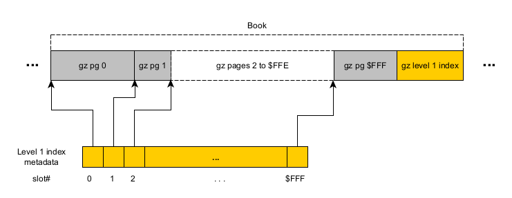

---------

# The ragzip file format specification

Imagine if you could randomly access any byte in a gzipped content, with a minimal seeking and skipping cost
using **indexes encoded in gzip's metadata**...

**Ragzip stands for randomly-accessible gzip**.
The ragzip format **is a compatible gzip (.gz) file**. It can be produced over a strictly appending output stream
like gzip, or with random access to the destination file to write.

Ordinary gzip consumers (a.k.a. readers) will see the same decompressed data.

However, the ragzip-compatible consumers can perform random accesses on a seekable storage api (ex: file system api or 
http bytes ranges requests) at strategic positions in order to benefit from the ragzip-specific metadata.

This ragzip metadata is stored in the gzip header of "empty" gzip members. The word "empty" means no actual compressed bytes.
This means, such **empty gzip members do not interfere with the decompressed data**.

In particular, the readers would seek the 64 bytes fixed length footer, the indexes tree and the pages.
Most importantly, the footer is documenting how to read the rest of the ragzip metadata and content, 
like a header normally does in many other formats.

The goal of this repository is to document the ragzip file format specification and provide a reference implementation.

The file extension remains ".gz"; the ragzip file is a gzip-compliant content and it should be treated **at least** like a .gz file
to ensure continued support in existing infrastructures. Should a distinct extension be used to clarify, ".rgz" is recommended.


### Exploiting the gzip format

Gzip blocks (members), as described by [RFC 1962](https://datatracker.ietf.org/doc/html/rfc1952), can be concatenated by design.
This means we can append an empty gzip member and it will not affect the decompressed data.
The ragzip format preserves this characteristic. A ragzip file **is** a gzip file.

Also, there can be one comment, one filename and many **extra fields** in any gzip member header, which also does not affect
the decompressed data. The ragzip format will store the metadata in an extra field. 
Using comment or filename fields would require encoding of the metadata bytes (like base-64) which is sub-optimal.
The metadata also does not fit the intended purpose of a gzip comment or filename.

Here is the general gzip file format:


The characteristic that is exploited here, is that a gzip member may contain only metadata and no content.
We may refer to those as "empty" or "metadata" gzip members.

To achieve logical (uncompressed) offset seeking, we map some key logical byte offsets to the starting position
of a gzip member in the compressed file. One (rejected) way to achieve indexing is to store key-value pairs.
Assuming sorted keys, this indexing model still implies an order(log n) binary search of the keys.
So instead of that, we chose to have a fixed length of uncompressed data compressed in a "page".
The logical offset to seek is split into a few array positions in a wide tree so that an order(1) array lookup
can be made (no key stored) to find the offset value. The visual aids below will hopefully make it clearer.

Additionally, the array size is a power of 2 so that simpler bit-wise operations can be used
to figure the index offsets. This is to avoid the slower div N and modulo N operations during pointer arithmetic.

The extra payload in a gzip header cannot exceed 65535 bytes. Should the extra header have only one subfield,
it cannot exceed 65531 bytes. Given the power of 2 array length choice we made, we will consider that a raw 32kB are
available (2^15 bytes) to store the metadata.

The **ragzip subfield ID will be "RA" (for random access) specifically SI1 = 0x52 and SI2 = 0x41**.
This is for all the metadata types (index, extension, footer). 

The ragzip metadata empty gzip members 
- **MUST contain an extra fields with one "RA" subfield**
- and that subfield **MUST be the first** in the extra field. This is crucial for the cacheless mode, described later.
- The extra field may contain other subfield after; that is allowed only to future-proof the ragzip format.
- The gzip member header **MUST NOT not contain any filename or comment field**
- Obviously, the empty gzip member **MUST contain an empty deflate stream**.

Here is the general ragzip metadata empty gzip member:


Note: In the diagrams further below, for the sake or reducing the
amount of information, the whole gzip member in the upper part will be labeled 'gz' while the subfield payload in
the lower parts will be labeled 'metadata'.


Given the limited number of subfield ids ever possible according to the gzip RFC 1962 (65280 or 3884 possible values
depending on your interpretation), it was preferable to avoid requiring more ids like "i1", "i2", "EX", "FT" and making 
classes of ragzip metadata. It would not have been helpful anyway since there is never any need to detect which type 
of metadata is found; only one type is expected for every occasion.

Some languages' file apis will expect a signed long (signed 64 bits) to seek file positions in the range 0.. 2^63-1.
The ragzip format specification is meant to facilitate implementation in all languages; it would restrict the offsets to 2^63-1
if that was the only concern. Due to indexing overhead and possible inflation of poorly compressible content (by less
than 200% though), it may be impossible to index logical offsets up to 2^63-1 as the page gzip member file offset 
might be above 2^63-1. Therefore, **logical offsets MUST be in the range from 0 to 2^62-1** (signed 63 bits long, 
not the signed 64 as usual). the absolute offsets into the ragzip file will still be written with 64 bits though
its most significant bit will always be 0, ensuring an ordinary signed long can be read, without resorting
to big integer support code. The ragzip format convention will not support 4096 petabytes uncompressed files or larger. Sorry.

It should be noted that is it possible to resume appending to a ragzip file by rewriting its tail bytes.
This will be explained later.


### Compression losses concerns

Interrupting the deflate stream between pages (blocks of data) causes the main compression loss.
Every new gzip member has to restart building the dictionary to compress.

Additionally, there is the insertion of uncompressed metadata (indexes).
The indexes metadata size is approximately the 8-bytes long offset needed to track each page.

This fixed size cost is subjectively worse when the actual data compression ratio are very high.
With a compression ratio of N, the effect of the metadata is N times worse.

For example, when each 8kB pages need one 8-bytes long offset, we have an overhead of 1/1024, about 0.1%.
If the compression ratio was somehow 20:1, the overhead appears 20 x 0.1% = 2%. Fortunately it is still pretty small.

So, in a nutshell, the worse offending characteristic is the page size. A larger page size minimizes both the deflate stream
losses AND the indexing overhead. Of course larger page sizes will cost in bytes skipping inside the gzip members at read time.
It's a compromise, as usual.


---------

# Overview

- **Page**: the unit of compressed data carried in one or more non-empty gzip member. Ex: 8kB (2^13).
    - All pages will have the same max size; this unique size MUST be between 512 bytes and 1GB (2^9 and 2^30).
    - **Readers and writers implementations MUST support page size exponents in the range [9..30]**.
    - Readers and writer are expected to assert the page size exponent and **MUST refuse a size outside
       the spec.** They may also refuse a size outside their own capacity.
      
- **Level # index**: the level 1,2..n index. For example, a level n index records offsets to level (n-1) indexes, except for
      the level1 index which records offsets to the pages initial gzip members.
    - All indexes of all levels will have the same max size; this unique size MUST be between 2 and 4096 (2^1 and 2^12).
    - **Readers and writers implementations MUST support index size exponents in the range [1..12]**.
    - Readers and writer are expected to assert the index size exponent and **MUST refuse a size outside
       the spec.** They may also refuse a size outside their own capacity.
    - **All indexes MUST be written AFTER any page or index for which they recorded an offset**.
    - The highest index level is always unique (occurs only once in the file towards the end) and it
       is referred to as the **top level index**, in the footer (see below).
    - Readers should navigate the index tree in a way that progresses and ends after all bits of the logical offset are used.
       This is to protect against maliciously crafted index pointers trying to cause infinite loops or recursion.

- **Extensions**: a linked list of empty gzip member carrying metadata for future extension to this format (still in the extra field "RA").
    - **The payload (not counting other extension fields) MUST NOT exceed 32kB (0x8000) bytes**.
    - **There MUST NOT be more than 50 extensions**; it's not a place to store data, it is a place for short directives.
    - Extensions are all custom and thus optional for the moment; as there is no upgrade to the ragzip spec, there no 'spec' extensions yet.

- **Footer**: the fixed length end portion of the file which specifies the ragzip parameters, the top level index and the optional extensions.
    - **The footer gzip member MUST be exactly 64 bytes long.**


--------

Here are some preliminary diagrams to visualize the explanations further below.
Let's start all zoomed-in on pages of compressed data.

Example of full level 1 (book) of 4096 pages with its index:




Now, zoom out the above and nest it in a level 2 (shelf).
Example of partial (last) shelf with only 254 books (0..253) in its index:


Further levels would continue the pattern shown for level 2.
A level 3 would record offsets to the index of level 2 shelves in the file. And so on.

Level 3, 4, 5, 6 could be informally called case, aisle, floor and store, to continue the analogy.

Now, zooming out again, let's assume the above levels are written and the highest level index is called the "top index".
We finish the ragzip file with the following:
- all partial indexes from lower level to top index (last 2 shown in example)
- extensions linked list (details about extensions to come later) (3 extensions shown in example)
- the footer


---------


# Detailed elements

Some general encoding rules:

- The numbers are written in big endian mode
- long is 8 bytes; always signed to avoid languages limitations
- int is 4 bytes; signed or not depends on purpose.
- Arrays don't have lengths written; the subfield payload length is sufficient at the moment to figure the array length.
- All gzip extra subfields have SI1='R' and SI2='A' (marked 'RA').

The ragzip file MUST end by writing the
- last page
- all last indexes from level 1 to level N when they exist
- all extensions from first to last when they exist
- the footer

Failing to save the metadata member in this order will cause readers to need adaptative code to reopen and
append a ragzip file (discussed later). Of course the minimum metadata gzip member offset, after the last page,
can be discovered; a predictable order is preferred and means a single algorithm to code, and better portability
across implementation.


### Pages

A Page is a finished gzip stream, containing a fixed amount of bytes which is a power of 2 as defined in the footer's
treespec (see footer section below). Once a reader is done seeking the index levels and opens a page gzip at a coarse
power of 2 position, the specific position can be reached with stream bytes 'skipping'.

It should be noted that the reader MUST be able to traverse any empty gzip, that is,
to seamlessly traverse consecutive pages and metadata boundaries. The ragzip pages and metadata (empty gzip members)
should not be an obstacle to decompressing the gzip file to its very end.

Smaller page size improves seeking performance (by reducing the average skipping distance)
but at the cost of indexing overhead. However, it is expected that there is a diminishing return on shrinking
pages, as the cost of opening and traversing indexes will increase, even though in order(log n) fashion.


### Indexes

Using longs offset is deemed to be simpler on implementations, making the pointer arithmetic uniform at all index levels.

Remember that the deflate stream may actually inflate the data (when poorly compressible data is used) and we cannot risk
using 63 bits logical addresses to uncompressed bytes, only 62. If we did used 63 bits, the offset on file could require 64 bits
and we want to avoid that.

The use of 8 bytes positive absolute offsets (on 62 bits) for any level index is required.
The format is therefore simply:

- long[] offsets: the absolute positive long offsets to lower indexes (or pages)

The last index at each levels can be partial when it addresses the last page of uncompressed data. The index tree is
rarely ever perfectly full at all levels. When those last indexes are partially filled, the gzip subfield length will be
shorter; it determines the long array length (longarray_length = subfield_length / 8). 
When the index is full, the array length is the preset power of 2 used for
all indexes as defined in the footer's treespec. See footer section.

For more justifications, see the [FAQ.md](FAQ.md).

Given that at least 9 bits are used by the page logical offset, there are 62-9 = 53 bits of logical offset left to partition into levels.
Thus, there cannot be more than 53 indexes levels (if they were to be indexing 1 bit only, which is not recommended for performance reasons).
Indexes size is only allowed to be less than 2^12 (4096) to reduce the amount of index bytes to load (and possibly to cache).
It also makes testing easier during your implementation of multiple levels (much less data required to fill up lower levels).

As stated before, all indexes MUST be written AFTER any page or index for which they recorded an offset. Doing otherwise
makes it very difficult to re-open and append an existing ragzip. In other words, for example, you cannot flush out a level2 index
that you anticipated will be full, ahead of its last level1 index just created and all the pages not yet written.


### Extensions
```
    +-------------------+-------+----------+----------------------+
    | previousExtension | flags | id       | extension payload    |
    | eeeeeeee eeeeeeee |  ff   | iiiiiiii |     ....             |
    +-------------------+-------+----------+----------------------+
```
The extensions are a singly linked list. Each extension must have:

- long previousExtensionOffset: an absolute long offset to the previous extension, or -1 to end the list.
- byte flags: the 8 bits flags of the extension. From MSB-to-LSB, the bits are: SRRRRRRR, where S is the spec bit, and R's are reserved bits.
    - when S=1, it is a reserved extension to the ragzip spec. There is no definition of any spec extension yet
    - when S=0, it's a custom extensions and it could be ignored by readers unaware of it, without consequence.
- int extension ID: the extension identifier
- byte[] data: payload bytes (maximum 32kB or 0x8000) of the extension (until the end of the subfield).


As mentioned, with the spec bit S=1 (i.e. flags = 0x80) and its accompanying id and data, we will be able to augment
the ragzip specification and parameterize the file. These extensions are essentially more "headers" that most
file formats would normally put at the beginning of the file. In future ragzip format, we will need more footers.
Since we cannot stream bytes in reverse, reading additional footers requires jumping back to the start of earlier empty gzip members.
That's why it's a linked list.

It was important to embed the tail of the extensions linked list in the footer right away, since 
**the footer forever has a fixed length, regardless of the version**. We want to be able to update this format some day
and the only place to store further ragzip parameters will be in extensions.

The linked list tail is saved and it means the extensions will be read in the reverse order they were appended in the file.
The extensions order may be significant in the future but not in version 1.0.
The last extension written is the first read and it may be informing how to process the others.
Moreover, should the file be augmented with more extensions after initial encoding,
it requires less file rewriting to just append new extensions to this linked list.

As stated earlier, no more than 50 extensions are allowed.
Readers should enforce this limit to avoid infinite loops from maliciously crafted extension "previous" pointers.
Writers should fail as soon as violations are known, preferably before writing the footer to avoid corrupting the footer.
Everything done before the footer may represent a huge effort and throwing an exception on close is not ideal.

To have room for future specification of an extension, the current payload limit is 32kB (0x8000).
With the 13 bytes of other fields, extensions are therefore currently RA subfields of at most 0x800d (32781) bytes.
Violations of the extension max length must be caught as early as possible by writers.
Readers may choose to tolerate excessive payload length, but that may cause issues when resuming a ragzip, if the extensions
are simply reused and the writing code rejects them. Since the footer and extensions are read very early when opening a
ragzip, it is recommended to reject max length violations, or at least to warn and possibly ignore such extension if 
it is too harsh to fail. Perhaps some implementations may allow adjusting extensions until just before the ragzip is finished.


### Footer

```
     +----------+-----------+-----------------+-----------------------------------+-------------+
     |version   |treespec   |uncompressed size|top index offset |ext.tail offfset |padding*     |
     |MMMM mmmm |00 LL II PP|uuuuuuuu uuuuuuuu|tttttttt tttttttt|eeeeeeee eeeeeeee|???????? ????|
     +----------+-----------+-----------------+-----------------+-----------------+-------------+
```

The ragzip footer is a fixed length empty gzip block of 64 bytes that a reader must seek from the end of the file.
It describes, in order:

- int version : MMMMmmmm where MMMM is for major, mmmm is for minor, currently 0x00010000 for 1.0
- int treespec : where LL is the number of levels, II is the index size number of bits (base-2 exponent), and PP is the page size number of bits.
    - Example: 2 levels, of 2^13 = 8kB pages with indexes of 2^12 = 4096 slots: treespec = 0x00020c0d.
- long totalUncompressed: the total number of uncompressed content bytes (not metadata) contained in the whole ragzip file
- long topIndexOffset: the file offset of the top level index
- long extensionsTailOffset: the file offset of the extensions linked list tail. Set -1L for no extension.
- variable padding: unused bytes whose only purpose is to ensure the footer can be 64 bytes exactly.

The footer payload is at least 32 bytes. The empty gzip 'deflate stream' may depend on the deflate block mode 
and on the implementation when encoding "nothing". Regardless of how justified this tolerance is, and to make it easier
on the implementers to ensure the footer has fixed length, the footer is padded to stretch the gzip final member
to a familiar 64 bytes.

For example: in the case of an empty deflate stream expressed on 2 bytes (0x03 0x00), the gzip member would be 20 bytes long.
When we add the EXTRA field (XLEN of 2 bytes) with one subfield (4 bytes without its payload), it gets to 26 bytes.
With the 32 bytes of useful ragzip footer payload, we get to 58 bytes of gzip member, so in that case the padding would be 6 bytes.

Keep in mind that a ragzip of a single full or partial page can show a number of levels == 0, in which case the 
top index offset is necessarily pointing at offset == 0 (the first page gzip member).


---------

# Reopening and appending ragzip.

With the above knowledge, you can understand now that the file's end (partial page, partial indexes, extensions and footer)
can be loaded, truncated and updated until the ragzip needs to be closed again (and these elements appended farther
after the new last page).

The last page is likely to also be partial (ex: 2000 bytes of a max 8192 bytes page size).
This means the amount of uncompressed bytes allowed in the next gzip member will be less than
a full page (ex: 6192 bytes only). Since both pages are consecutive, the uncompressed data will be
the same, but there will have been 2 gzip members to deliver that.

Alternately, in order to avoid such seam and compression ratio loss, the program may choose to load the entire partial page, 
truncating it from the file too, and feed the data in a new page.


---------

# Use cases

Accessing rapidly any byte in a large ragzip file has benefits; here are a few cases that can be implemented.

- Content servers, cloud storage providers
    - Any remote storage could "ragzip" the files while maintaining service to "bytes range" queries.
- Client libraries adapter
    - the calling code may continue doing read-only random access on a file channel abstraction but it would ragzip-compressed.
- zless, ztail...
    - Large compressed log files could be navigated faster when seeking an offset. A frequent case is to reach the end of the content.


Combining the a ragzip seekable channel over an http seekable channel, a client-side library can be fooled into thinking 
it sees a decompressed file, while the ragzip adapter accesses the bytes over http range requests.
The client doesn't knowing it was seeking in a ragzip, much less going remote over http.

This combination saves:
- storage space,
- network bandwidth (as not all protocols support compression),
- some amount of server CPU (no need to compress just in time to send over the network),
- and some latency (it depends on the usage pattern of course).


Ragzip may also be used merely to **enable parallel compression/decompression** without using the random access benefits.
There are alternative other than ragzip to achieve parallelism but having a solid ragzip spec opens up various implementations.
**The walkable tree of indexes and pages enables the process of making parallelizable tasks**.


----------

# Implementation tips

For a ragzip reading program, the most important performance boost comes from caching indexes and pages, to avoid relentless reloading
of gzip members, particularly the footer and the upper indexes. It is recommended to cache 2 indexes at each level, with a
least-recently-used (LRU) eviction strategy.

As for caching pages, having even just a few can help some applications momentarily making numerous tiny jumps within the same area,
sometimes across the boundary between 2 pages.

Other applications will actually read the ragzip after seeking a page but may read well past that page and many others following.
The beauty of gzip is that your inputstream or readable channel can behave like a regular gzip input stream and seamlessly 
traverse page boundaries and metadata. In this type of applications, caching pages is wasteful and slowing down the streaming as
you have to implement page boundary checks and switch from the cached page in memory back to the gzip input stream on file.

Moreover, caching pages is best left to a buffering layer on top of the seekable readable byte channel.
Usually, such external page caching would be perfectly aligned with the ragzip pages but they could be bigger or smaller.


### When to create/flush new pages and indexes

Ideally, you'd wait to overflow a page or index. It is tempting to check the conditions after the write, but you'd be
creating empty pages or empty indexes, only to remove them later upon finish (if you want a clean ragzip).

One crucial note though, as stated before, the index MUST be written AFTER everything if refers to (pages or lower level index).

As you cascade the overflowing index to higher levels, they may overflow too and so on. This is a neat place for a recursive method,
which the ragzip finishing will reuse (because all partial indexes offsets need to be recorded once written and that can lead to
some more index overflowing).


### Cacheless mode

On the other hand, caching takes memory. When usage patterns imply that caching will be futile, a cacheless mode is recommended.

The cacheless mode is a direct read of the gzip extra subfield's payload without reading all of its 32kB subfield, only to access 8 bytes of it.
For that, we derive an offset to the uncompressed location of that subfield payload, which is fortunately a fixed 
distance from the start of the empty gzip member (at 16th byte). This presumes the ragzip convention was respected by the producer
and it has a single subfield in the gzip EXTRA header. Any index's long array position L, formerly looked up as in longarray[L],
can be virtualized as reading an 8-bytes big-endian long starting at file.seek(gzindex_offset + 16 + 8\*L).

This is not as slow as you might think; a lot of time/io is saved by not loading the whole gzip member.


### Parallel encoders and decoders

Having fixed length pages allows parallel compression of pages. You may have seen that before.
However, if you have file system or seekable write access, there is no reason to write with a single thread as some implementations do.

As soon as a page's compressed length is known, (in memory, not even written yet), the following page knows where
its gzip member will start on file (or in the seekable writable channel) and thus can be written in another parallel channel
(as long as there is no file locking in the way of course).

Meanwhile, a parallel decoder doesn't suffer from an ordering stage as the parallel encoder does, given
that each compressed page has a start offset and a very precise logical start offset and length in 
the decompressed form.

Beware of excessively large pages to encode or decode, especially if they are to be loaded in memory.


### A note on buffering input

Remember that we are opening (parsing and skipping into) a gzip member almost at every seek.
There are some easy bypass when the new position is just ahead in the same gzip member, or the one after, and it may be faster
to deflate further wasted bytes than to re-navigate the indexes.

However, in general, seeking will cause parsing of a new gzip member. If you implemented buffered input on your source, this may 
perform a buffer fillup on each gzip initialization. The focus here is about the pre-fetch size that should occur to try to avoid
loading too many bytes.

Nearly any small pre-fetch size allows a quick parsing of the gzip member header; it usually only needs 10 bytes.
When reading indexes, a larger fetch size might be indicated, especially when using index caching
where the full index will be loaded anyway. Reading the fixed length footer (fetch 64 bytes) or extensions (maybe 33kB) doesn't
require much optimization as it occurs only once.

For data-carrying gzip members, it's not usually helping to make short pre-fetch sizes. The position to seek inside the page
is usually random, and so is the amount to skip. If you had 8kB (uncompressed) pages at and chose to pre-fetch only 128 compressed bytes
while the compression ration is 2:1, you'd have pre-fetched about ~250 bytes of uncompressed data (1/32nd of the page). Then,
31/32nd of the positions will require loading more bytes again. Small pre-fetch sizes do not help on data like they do on metadata.
There might be a mathematical proof of where the data-carrying gzip member pre-fetch size would be optimal, but without 
knowing the actual cost of fetching twice versus the cost of fetching bigger, there is no justification to specify what it should be.

All that is assuming the underlying source can actually fetch a size that small, like over a network. For direct file access, it's more
likely that the OS will transfer entire blocks anyway, like 512, 1024 bytes or more and it may actually be slower to call the OS over and over
for tiny fetch sizes.

To summarize, implementers may want to parameterize the size of the pre-fetch on seek, based on the type of gzip member about
to be read.


---------

# Java source files in this repository

This is a standard maven project. See the usual 'mvn compile', 'mvn test' and 'mvn javadoc:javadoc'.

There are numerous package-level implementation's support classes, but the note-worthy public classes are the following:

**CLI classes (with a main())**

- RagzipEncoderMain: compress the input into the ragzip format (single-threaded) (uses RagzipOutputStream).
- RagzipParallelEncoderMain: compress the input into the ragzip format (multi-threaded).
- RagzipParallelDecoderMain: decompress the ragzip to file (multi-threaded).
- GzipEncoderMain: demo using GzipWritableChannel (single-threaded) to compress to regular gzip.
- GzipDecoderMain: to decompress regular gzip (single-threaded).


**Principal classes**

- RagzipOutputStream: an outputstream that partitions and produces the ragzip format.
- RagzipFileChannel: a filechannel that can seek and decompress a ragzip file (includes optional index caching).
- Extension: for adding custom extensions to the ragzip.


**Demo classes**

- GzipReadableChannel: unrelated to ragzip, but implements gzip decompression over a ReadableByteChannel (demo).
- GzipWritableChannel: unrelated to ragzip, but implements gzip compression over a WritableByteChannel (demo).
- CachingSeekableReadByteChannel: unrelated to ragzip, but implements caching of a SeekableByteChannel; this is 
   to compensate for the lack of page caching in the RagzipFileChannel.
- RagzipParallelEncoder: a multi-threaded ragzip compressor.
- RagzipParallelDecoder: a multi-threaded ragzip decompressor.


---------


# Acknowledgments and references


The [Gzip RFC 1962](https://datatracker.ietf.org/doc/html/rfc1952) is a mandatory read, of course. It is short and concise.

This repo does NOT depend on [Apache Common-Compress](https://github.com/apache/commons-compress).
I patched their version 1.28.0 to offer the gzip EXTRA and subfields support but I couldn't wait for their release.
This is why my code may seem familiar to what I gave to Apache.

[Pigz](https://zlib.net/pigz/) parallelizes the making of one deflate streams (within a single gzip member) by making deflate blocks in parallel;
it does not parallelize the making of multiple gzip members (concatenated within a single file)
which is far more trivial and sufficient in general despite some compression ratio loss.

There's [pauldmccarthy/indexed_gzip](https://github.com/pauldmccarthy/indexed_gzip) python implementation,
relying on [Mark Adler's zlib's examples/zran.c](https://github.com/madler/zlib/tree/develop/examples).
There was also [rapidgzip](https://github.com/mxmlnkn/rapidgzip) which relies on indexed_gzip.
All three projects lack format documentation though. I still have no idea what they write, hence the need for a public spec.

The [linkedin/migz](https://github.com/linkedin/migz) also uses a gzip extra header subfield 'MZ' to store compressed 
length of members. This comes down to traversing a list to skip over entire gzip members. Its goal is not to enable random
access but enable parallel decoding.


---------

# See also

[Frequently asked questions](FAQ.md).


---------

Copyright (c) 2024 Danny Deschenes.
